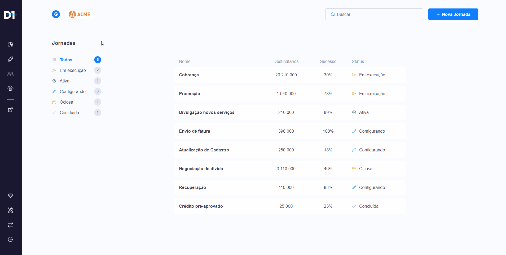
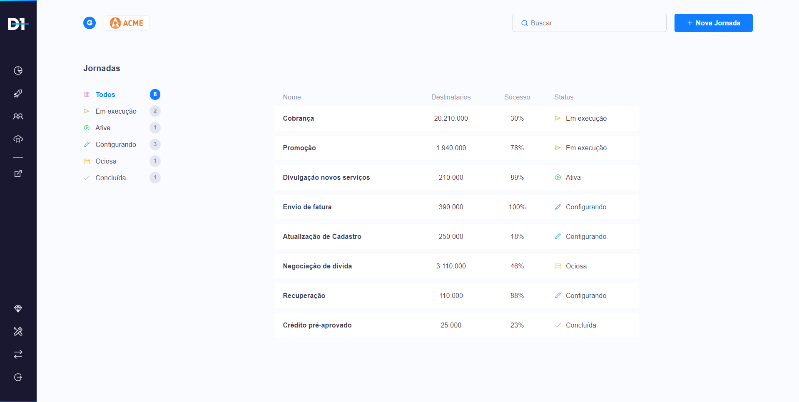
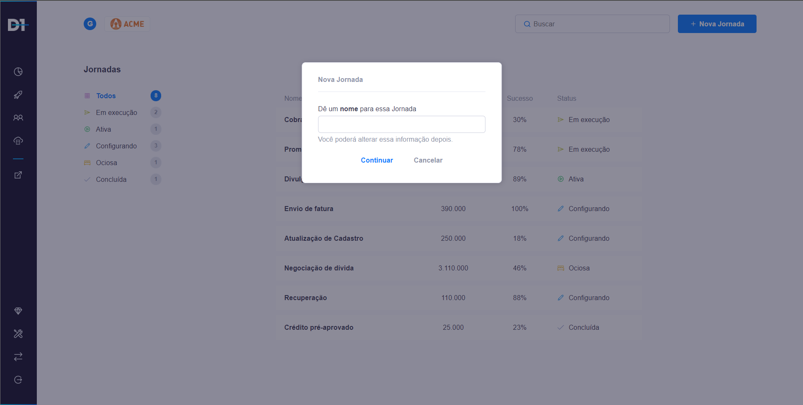

<h1 align="center">
    
    <br>
    D1 - Better Journeys
</h1>

<p align="center">
  

  

  
</p>

</img>

</img>

</img>


## 👨‍💻 Technologies

-  [ReactJS](https://reactjs.org/)
-  [TypeScript](https://www.typescriptlang.org/)
-  [Styled-components](https://www.styled-components.com/)
-  [Axios](https://github.com/axios/axios)


## 📖 How To Use

```bash
# Clone this repository
$ git clone https://github.com/Shadaw/direct-one.git

# Go into the repository
$ cd direct-one

# Install dependencies
$ yarn

# Run project
yarn start
```


